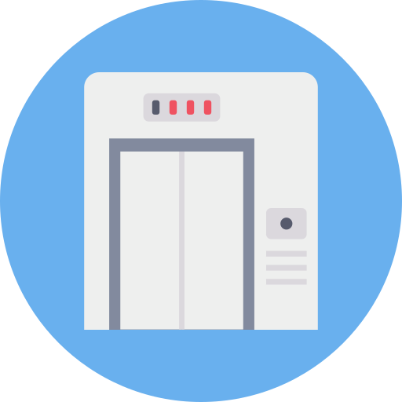

<h1 align="center">
  <br>
  <a href="#"></a>
  <br>
  Projeto de acionamento inteligente de elevadores
  <br>
</h1>

<h4 align="center">Um projeto de acionamento de elevadores de uso exclusivo para Pessoas com Deficiência! Step-by-Step</h4>

## Sumário
* [Sobre o projeto](#sobre-o-projeto)
  * [Softwares usados](#softwares-usados)
  * [Hardwares usados](#hardwares-usados)
* [Montagem do Projeto](#montagem-do-projeto)
* [Programação do dispositivo](#programação-do-dispositivo)
* [Atuador do projeto](#atuador-do-projeto)
* [Contribuindo](#contribuindo)
* [Licença](#licença)
* [Contato](#contato)

## Sobre o projeto
O projeto faz parte da atividade desenvolvida pelo grupo PET Elétrica UFBA nomeada de “Assistividade”. A atividade de pesquisa tem como objetivo desenvolver materiais técnicos e tecnologias para auxiliar pessoas com deficiência (PCDs), levando estudos e informações para a comunidade interna e externa à faculdade acerca de temas ligado a PCDs. Atualmente o grupo responsável pela atividade tem a difícil e empolgante missão de criar um dispositivo, sob a forma de um protótipo, capaz de realizar o controle de acesso a elevadores de uso exclusivo para pessoas com deficiência ou com mobilidade reduzida. Através desse projeto busca-se diminuir a incidência de pessoas sem deficiência ou sem restrições de mobilidade com acesso a elevadores específicos, garantindo, portanto, o uso dos elevadores por parte do seu público de destino. Para conceber esse projeto, utilizaremos componentes eletrônicos e microprocessados com ênfase em plataformas de prototipagem eletrônica, sensores e atuadores.

### Softwares usados
* [Arduino](https://www.arduino.cc/en/Main/Software)
* [Fritzing](https://fritzing.org/download/) (Opcional)
* [Tinkercad](https://www.tinkercad.com/) (Opcional)

### Hardwares usados
* Placa de desenvolvimento NodeMCU
* Módulo Leitor RFID RC522
* Micro Servo 9g SG90 TowerPro
* Protoboard
* Fonte de energia (Ex: bateria)
* Jumpers
* Diodo Emissor de Luz (LED)
* Resistores

## Montagem do Projeto
Aqui colocamos a foto do circuito no fritzing e damos instruções de montagem
## Programação do dispositivo
Aqui a gente coloca o código e explicamos as suas principais funcionalidades
## Atuador do projeto
Aqui a gente coloca o tutorial de construção do elemento atuador e formas de criar esse atuador
### Instalação e configuração

Uma série de exemplos passo a passo que mostram como fazer a instalação e configuração do softwares citados:

```
Passo a passo de instalação e configuração dos softwares.
```

e,

```
Exemplos...
```


## Testes necessários para constatar eficácia do projeto

Explicar como executar os testes automatizados para este sistema

### Separar em ordem metodológica os testes necessários

Explciar o que cada um teste faz e para que serve.

```
Testes...
```


## Contribuindo

Contribuições são o que tornam a comunidade de## Contribuindo código aberto um lugar incrível para aprender, inspirar e criar. Todas as contribuições que você fizer são **muito bem vindas**!

Aqui está a estrutura de uma pasta, se você quiser contribuir com um tutorial completo ❤:
```
.
├── assets
│   ├── protoboard.png
│   └── pinoutv3.png
├── code
│   └── code.ino
├── fritzing
│   └── arquivo.fzz
└── README.md
```

E o modelo do arquivo README está aqui: [_MODELO_](MODELO.md).

Passos para enviar uma contribuição para nosso repositório:
1. Crie um _Fork_ do projeto
2. Crie sua _Branch_ (`git checkout -b feature/AmazingFeature`)
3. Dê um _Commit_ nas suas mudanças com uma mensagem (`git commit -m 'Coloquei um recurso legal'`)
4. _Push_ para esta _Branch_ (`git push origin feature/AmazingFeature`)
5. Abra uma [_Pull Request_](pulls) e aguarde :D

## Licença

Distribuído sob a licença MIT. Veja [LICENSE](LICENSE) para mais informações.

## Contato

PET Elétrica - [@peteletricaufba](https://www.instagram.com/peteletricaufba/?hl=pt-br) - peteletricaufbadee@gmail.com

Link do Projeto: [github.com/PETEletricaUFBA/Projeto_elevador](https://github.com/PETEletricaUFBA/Projeto_elevador)

## Autores
* **Josias Machado** - *Initial work* - [josiasmachado01](https://github.com/josiasmachado01)
*  **Breno Amin** [brenoamin](https://github.com/brenoamin)

Veja também a lista de [colaboradores](https://github.com/PETEletricaUFBA/Projeto_elevador/graphs/contributors) que participaram deste projeto.

## Agradecimentos

* Ex01
* Ex02
* Ex03
